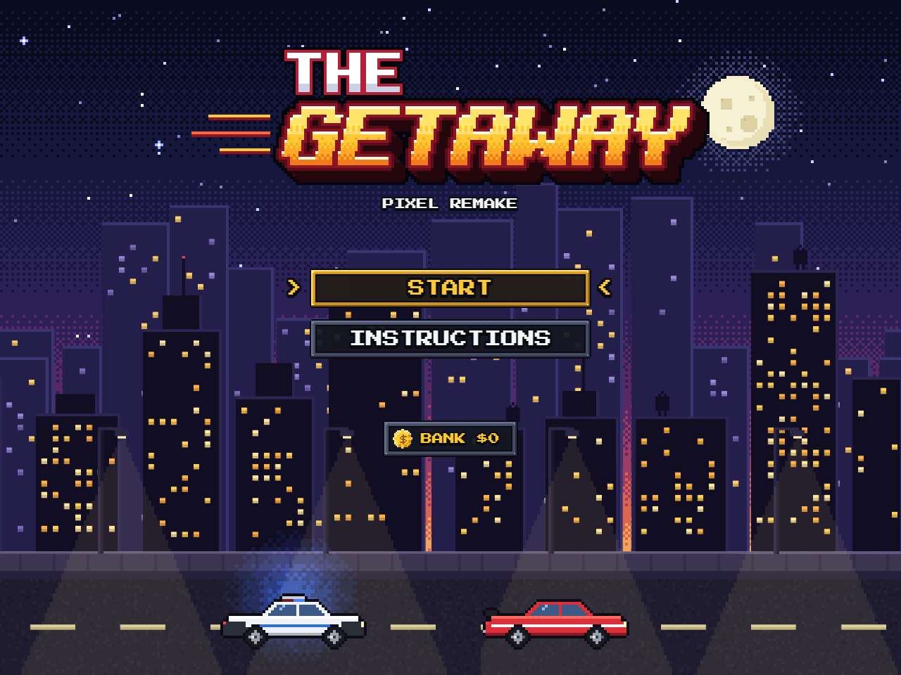
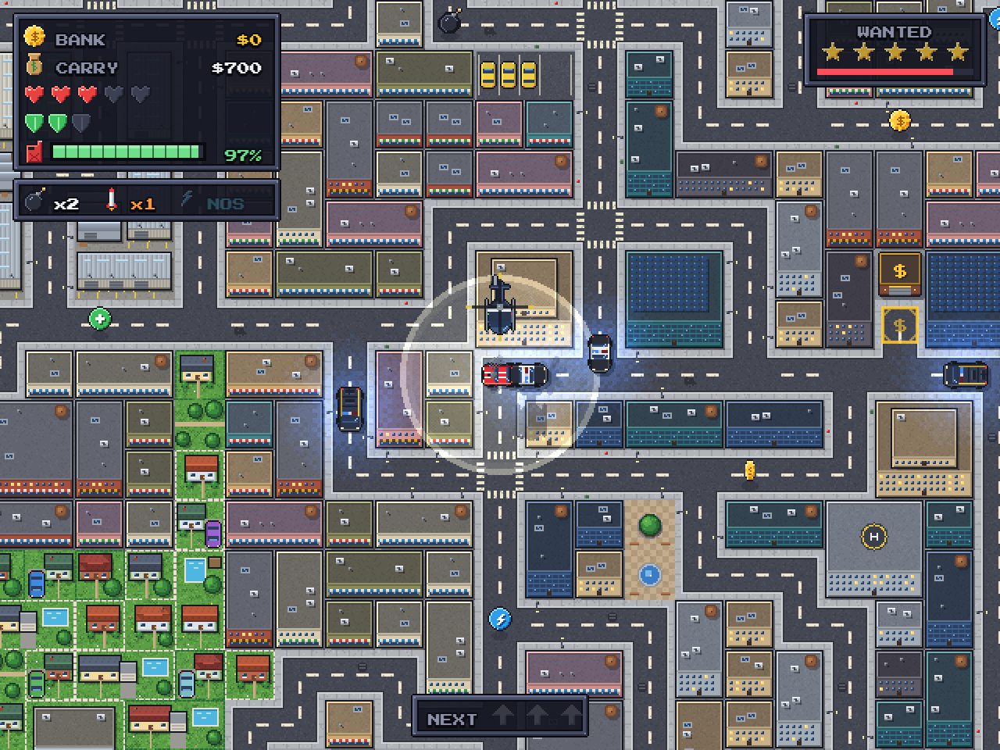
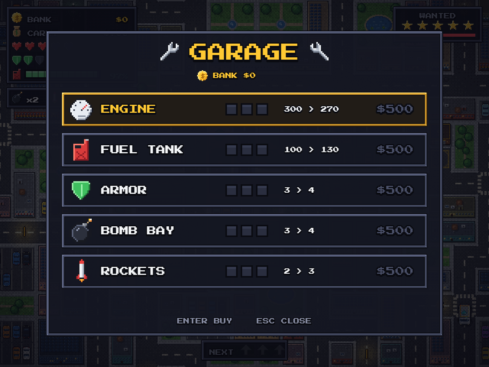
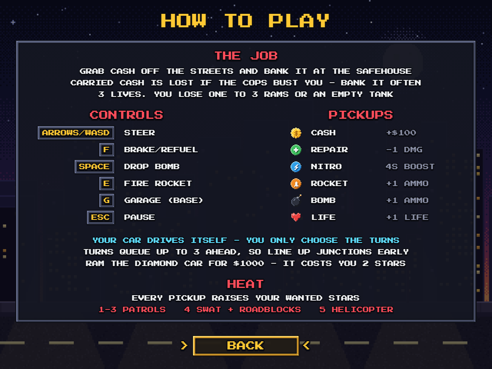

# The Getaway

A pixel-art arcade getaway game. You drive a car through a procedurally
generated city, grab money off the streets, and bank it at your safehouse
before the police shut you down.

Built with [Phaser 3](https://phaser.io/) and [Vite](https://vite.dev/).

**Play it:** https://zednicek-adam.github.io/Getaway/

| | |
| --- | --- |
|  |  |
|  |  |

## The loop

Money you pick up is **carried**, not earned. Carried money is lost when the
police catch you — it only counts once you drive it back to the safehouse (the
gold `$` pad) and deposit it.

Every pickup raises your **heat**, and heat buys the police stars:

| Stars | Response |
| ----- | -------- |
| 0 | One patrol roaming aimlessly |
| 1–2 | Patrols actively home in on you |
| 3 | Three cars driving straight at you |
| 4 | SWAT van joins; roadblocks start dropping ahead of you |
| 5 | Second SWAT van and a helicopter that slows you from overhead |

Depositing ends the chase immediately. Otherwise the chase runs on a 20-second
countdown that refuses to tick below 25% while a patrol can see you — you have
to actually break line of sight, not just outlast it. Once the chase ends, stars
decay one every five seconds.

Banked money persists between runs in `localStorage` and is spent in the garage.

### Losing

You have three lives. You lose one by taking a full damage bar (three rams by
default) or by running the tank dry. Either way, carried money is gone.

## Controls

| Key | Action |
| --- | ------ |
| Arrows / WASD | Steer (queues up to 3 turns ahead) |
| `F` | Brake — hold position, and refuel when parked on a station pad |
| `Space` | Drop a bomb (10s fuse, destroys police) |
| `E` | Fire a rocket along your facing, up to 8 tiles |
| `G` | Open the garage (only while parked on the safehouse pad) |
| `Esc` | Pause |

Touch devices can swipe to steer. An INSTRUCTIONS page shows this same summary
in-game, reachable from both the main menu and the pause menu; opening it from
pause leaves the run paused and returns you there. The pause menu can also drop
you back to the main menu.

The car drives itself forward; you only choose turns. Because turns are buffered,
you can line up a sequence through an intersection before you reach it.

## Pickups

Money is the bulk of what spawns; the rest is weighted rarer.

| Sprite | Pickup | Effect |
| ------ | ------ | ------ |
| spinning gold `$` coin | Money | +$100 carried, +1 heat |
| green `+` token | Repair | Removes one point of damage |
| blue lightning token | Nitro | ~1.5× speed for 4 seconds |
| orange missile token | Rocket | +1 rocket |
| black bomb, lit fuse | Bomb | +1 bomb |
| red heart | Extra life | +1 life, capped at 5 |

There is also a **diamond truck** (a silver armoured courier with a cyan gem on
the roof) roaming the map. Ram it to steal a $1,000 diamond — but it costs you
two stars instantly.

## The garage

Park on the safehouse pad and press `G`. Five upgrade tracks, three levels each,
costing $500 / $1,500 / $4,000 out of banked money:

| Track | Level 0 → 3 |
| ----- | ----------- |
| Engine | 300ms → 225ms per tile |
| Fuel tank | 100 → 200 |
| Armor | 3 → 6 hits |
| Bomb bay | 3 → 6 bombs |
| Rockets | 2 → 5 rockets |

Upgrades apply mid-run and persist across runs.

## Running it locally

Requires Node 20+.

```bash
npm install
npm run dev      # dev server
npm run build    # production build into dist/
npm run preview  # serve the built output
npm test         # vitest unit tests
```

Note that `vite.config.js` sets `base: '/Getaway/'` for GitHub Pages, so the dev
server and preview serve the game at `/Getaway/` rather than `/`. Vite prints the
full URL on startup.

## How the map is built

`NetworkGenerator` grows a road network outward from the player's spawn using a
growing-tree walk, rather than stamping a grid. It guarantees full connectivity,
balanced growth across all four quadrants, intersections at least 3 tiles apart,
and no dead ends except the spawn tile — so every road you can turn onto actually
goes somewhere. `MapManager` then places the safehouse and three fuel stations on
reachable, well-spaced pads and auto-tiles the roads.

Generation retries (up to 50 attempts) if a layout fails its reachability check.

The logic grid only knows *road* and *not road*. `cityLayout.js` decides what
that looks like. Road cells pick one of 47 autotiles from their neighbours, and
the streets carry their own sidewalks (lamps and hydrants included), so the
buildings behind them pack wall to wall. Each block of non-road cells becomes a
district: downtown towers in the middle, shops around them, then houses in
fenced gardens, with an industrial quarter of warehouses and container yards on
one side of town and parks scattered through the outskirts. Blocks are carved
into 1×1 / 2×1 / 1×2 / 2×2 lots and dressed from that district's pieces. It is
purely cosmetic and never feeds back into gameplay.

## Art

All pixel art is generated by code, so it can be tweaked and reproduced:

```bash
pip install pillow numpy
python tools/generate_art.py
```

This rewrites every PNG in `public/art/`, `public/favicon.png`, and the tile/frame
manifest in `src/generated/art.json`. The output is deterministic. Re-running it
without changes produces byte-identical files, so only real art changes show up
in a diff.

Everything is drawn at 1 art pixel = 1 image pixel from one shared palette, then
scaled with nearest-neighbour: 2× for the world (a 32px art tile is the game's
64px tile) and 4× for the title-screen backdrop. The game runs with Phaser's
`pixelArt` mode on, so nothing is ever smoothed.

| Module | Draws |
| ------ | ----- |
| `pixelkit.py` | canvas helpers: shapes, outlines, bevels, dithering, RotSprite rotation |
| `art_city.py` | the city tileset: streets with sidewalks, and lot pieces for each district |
| `art_sprites.py` | vehicles, helicopter, pickups, props, effects, HUD icons, UI panels |
| `art_menu.py` | title-screen parallax skyline, side-view chase cars, the logo |

## Layout

```
src/
  config.js         all gameplay tunables in one object
  constants.js      tile size, map dimensions, tile/direction enums
  art.js            asset keys, frame indices and shared animations
  cityLayout.js     cosmetic city dressing: road autotiles, districts, lots
  fx.js             one-shot effects (explosions, smoke, sparks, popups)
  GameState.js      pure run state — money, lives, fuel, stars, damage
  garage.js         upgrade pricing and derived-stat math
  storage.js        versioned localStorage save with sanitising loader
  pathfinding.js    BFS used by police AI
  turnQueue.js      the buffered-turn queue
  generators/       NetworkGenerator — procedural road layout
  managers/         Input, Map, Police, UI
  objects/          Car, PoliceCar, SwatVan, Helicopter, DiamondCar,
                    Collectible, Bomb, Rocket, Roadblock
  scenes/           Boot, Menu, Game, Pause, Garage, Instructions
  ui/               shared look: pixel text, 9-slice panels, button menus
  generated/        art.json manifest written by tools/generate_art.py
test/               vitest suites for the Phaser-free modules
tools/              the pixel-art generator (Python)
```

The design splits Phaser-dependent rendering from plain-JS game logic. Anything
holding rules — `GameState`, `garage`, `storage`, `pathfinding`, `turnQueue`, the
collectible weight table, map reachability, city layout — imports no Phaser and
is unit tested directly.

## Deployment

Pushes to `main` trigger `.github/workflows/deploy.yml`, which runs the test
suite, builds, and publishes `dist/` to GitHub Pages. A failing test blocks the
deploy.
